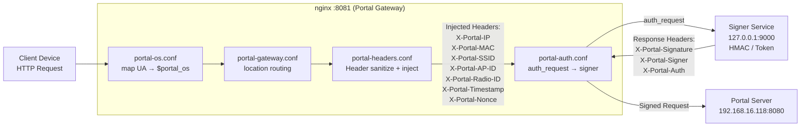

# Portal Gateway Architecture

本文档说明 **portal-gateway（nginx-based Captive Portal Gateway）** 的整体架构、配置文件职责划分，以及 HTTP 数据在 nginx 内部的完整处理顺序。

---

## 1. 设计目标

Portal Gateway 的设计目标并不是充当传统意义上的 Web Server，而是：

* 作为 **HTTP 数据面的入口网关**
* 在 L3/L4 已放行的前提下，对 HTTP 进行 **可信重组**
* 明确 **客户端不可信 / 网关可信 / 控制面裁决** 的信任边界
* 支持多 OS（iOS / Windows / Android / HarmonyOS）探测行为
* 为后续 C/C++/Go 实现 signer 与 agent 预留接口

一句话概括：

> **nginx 在这里是一个“有状态的 HTTP 数据面防火墙 + 信任注入器”。**

---

## 2. 配置文件总览

目录结构如下：

```
/etc/nginx/
├── nginx.conf
└── conf.d/portal/
    ├── portal-os.conf
    ├── portal-gateway.conf
    ├── portal-headers.conf
    ├── portal-auth.conf
    ├── upstream-portal.conf
    └── upstream-signer.conf
```

这些文件并非平级随机加载，而是形成了一条**清晰的处理流水线（Pipeline）**。

---

## 3. 各配置文件职责说明（按处理顺序）

### 3.1 nginx.conf —— 根配置 / 装配层

**角色：** 系统入口与装配器

**职责：**

* 定义 `http {}` 全局上下文
* 设置日志、worker、基础 HTTP 能力
* `include conf.d/portal/*.conf`

**特点：**

* 不包含任何 Portal 业务逻辑
* 只负责“接线”，不做判断

---

### 3.2 portal-os.conf —— 客户端 OS 识别层（观测层）

**角色：** OS / 探测行为识别

**实现方式：**

* 使用 `map $http_user_agent $portal_os`
* 严禁使用 `if` 判断 UA

**输入：**

* `User-Agent`
* `Host`

**输出变量：**

* `$portal_os = ios | windows | android | harmonyos | unknown`

**用途：**

* 日志分类
* OS 探测路径识别
* 后续策略扩展（而非直接控制流）

---

### 3.3 portal-gateway.conf —— 主调度层 / 路由层

**角色：** HTTP 流量调度中心

**核心职责：**

* 定义 `server {}` 与 `location {}`
* 区分三类请求：

  * OS 探测请求（如 `/hotspot-detect.html`, `/generate_204`, `/ncsi.txt`）
  * Portal 登录相关请求
  * 其他 HTTP 流量

**特点：**

* 明确将 OS 探测路径做成 **独立 location**
* 避免探测流量污染 Portal 业务统计

---

### 3.4 portal-headers.conf —— 可信 Header 注入层（安全边界）

**角色：** 信任边界隔离与 Header 重构

**阶段 1：清洗客户端伪造 Header**

```http
X-Portal-MAC
X-Portal-IP
X-Portal-SSID
X-Portal-AP-ID
X-Portal-Radio-ID
X-Portal-Signature
```

**阶段 2：注入可信 Header**

```http
X-Portal-IP        ← $remote_addr
X-Portal-Timestamp ← $time_epoch
X-Portal-Nonce     ← $request_id
X-Portal-MAC       ← fw / map 注入
X-Portal-SSID
X-Portal-AP-ID
X-Portal-Radio-ID
```

**设计原则：**

> 客户端永远不能直接控制 Portal 身份字段。

---

### 3.5 portal-auth.conf —— 裁决层（auth_request + signer）

**角色：** 外部裁决接入点

**机制：**

* 使用 `auth_request` 调用 signer
* nginx 本身不判断对错

**发送给 signer 的信息：**

* HTTP 上下文
* 所有 X-Portal-* 可信 Header
* OS / IP / Timestamp / Nonce

**从 signer 捕获的 Header：**

```http
X-Portal-Signature → $portal_hmac
X-Portal-Signer    → $signer_status
X-Portal-Auth      → $auth_result
```

这些变量将再次注入到最终请求中。

---

### 3.6 upstream-signer.conf —— Signer 服务定义

**角色：** 控制面 / 密钥面

```nginx
upstream portal_signer {
    server 127.0.0.1:9000;
}
```

**特点：**

* 实现可为 shell / Go / C++ / Rust
* 可通过 Unix Socket 替换

---

### 3.7 upstream-portal.conf —— Portal Server 定义

**角色：** 业务终点

```nginx
upstream portal_server {
    server 192.168.16.118:8080;
}
```

负责：

* Portal 页面
* `/portal/login`
* `/portal/logout`

---

## 4. HTTP 数据处理全流程（含 Header 细节）



---

## 5. 设计总结

* nginx 被明确定位为 **HTTP 数据面 Gateway**
* 信任边界在 portal-headers.conf 处被彻底收紧
* 控制逻辑外置到 signer，避免在 nginx 内堆积业务复杂度
* 架构天然适合：

  * AC / Controller 模式
  * 多 SSID / 多 Radio
  * 后续 eBPF / C++ / Rust 加速实现

该文档是 portal-gateway 长期演进的架构基线。
